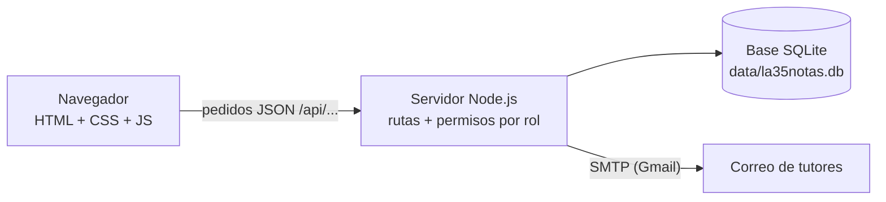
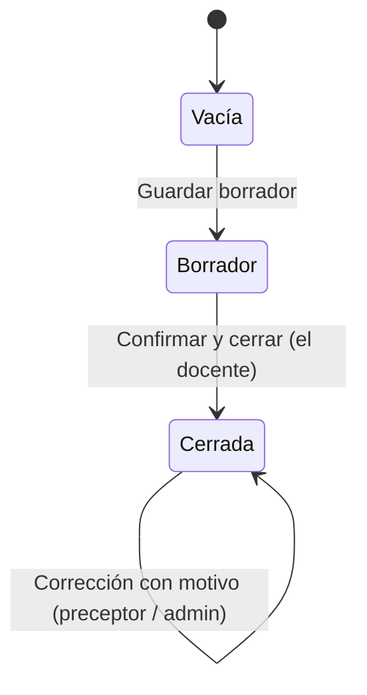
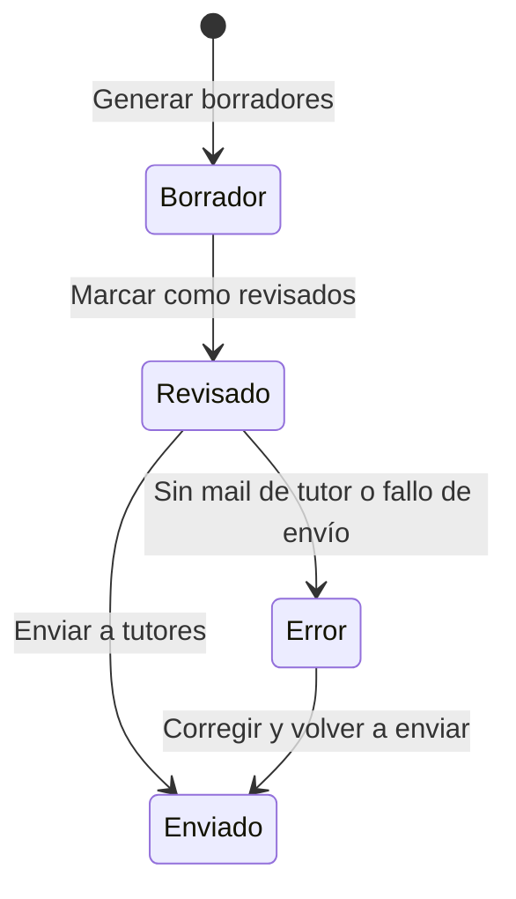

# Guía de funcionamiento – la35Notas

Guía para quien quiera **revisar, probar o evaluar** la plataforma: qué hace, cómo se interactúa con ella, qué recorrido conviene hacer y cómo está construida.

## 1. Qué es

Un sistema web de gestión escolar donde **cada persona ve y hace solo lo que le corresponde según su rol**:

- Los **docentes** cargan las notas de sus materias.
- **Preceptoría** controla asistencias, corrige notas, emite comunicados y envía los boletines por mail.
- **Dirección / administración** configura todo el sistema.
- Los **alumnos** consultan sus datos (solo lectura).
- Las **familias** no usan la plataforma: reciben todo por correo.

## 2. Cómo ponerlo en marcha

Requisito: **Node.js 22.5 o superior**. No hay que instalar librerías.

```bash
npm.cmd run seed    # crea la base con datos de ejemplo (--reset: la recrea)
npm.cmd start        # http://localhost:3000
```

En Windows/PowerShell, si aparece un error de scripts deshabilitados, usar `npm.cmd run seed` y `npm.cmd start`.
Siempre se entra por `http://localhost:3000`; no sirve abrir los `.html` con doble clic.

### Usuarios de demostración

| Rol | Usuario | Contraseña inicial | Qué es |
|---|---|---|---|
| Administrador | `admin` | `admin1234` | Acceso total |
| Profesor | `31928371` | `31928371` | Docente de *Prácticas Profesionalizantes* en 6° 1° |
| Preceptor | `28111222` | `28111222` | A cargo de 6° 1° |
| Alumno | `96103383` | `96103383` | Alumno de 6° 1° |

En el primer ingreso de cada usuario el sistema **obliga a cambiar la contraseña**. Para volver al estado inicial: `npm run seed` (borra y recrea los datos de ejemplo).

## 3. Mapa de pantallas por rol

| Pantalla | Admin | Preceptor | Profesor | Alumno |
|---|:-:|:-:|:-:|:-:|
| Panel General | ✅ | ✅ | ✅ | ✅ |
| Usuarios | ✅ | | | |
| Cursos y materias | ✅ | | | |
| Carga de notas | ✅ | ✅ | ✅ | |
| Asistencias | ✅ edita | ✅ edita | 👁 lectura | |
| Calificaciones / Boletín | ✅ | ✅ | ✅ | ✅ (solo las propias) |
| Comunicados | ✅ crea y envía | ✅ crea y envía | 👁 lectura | 👁 solo enviados |
| Envío de boletines | ✅ | ✅ | | |

El menú lateral **cambia según el rol**. Además, el servidor bloquea lo que no corresponde aunque se escriba la dirección a mano (ver sección 6).

## 4. Tipos de interacción

| Tipo | Dónde se ve | Qué ocurre |
|---|---|---|
| **Inicio de sesión** | Login | DNI + contraseña. Tras 5 fallos seguidos, bloqueo de 10 minutos. |
| **Cambio obligatorio de clave** | Primer ingreso | Ventana que no se puede cerrar hasta definir una contraseña nueva. |
| **Navegación por rol** | Menú lateral | Solo aparecen las secciones permitidas. En celular el menú se abre con el botón ☰. |
| **Formularios con validación** | Usuarios, comunicados | Si falta un dato o es inválido (DNI, email), aparece un aviso y no se guarda. |
| **Ventanas modales** | Nuevo usuario, nuevo comunicado, vista previa de boletín | Se abren sobre la pantalla y se cierran con Cancelar o Cerrar. |
| **Tablas editables** | Carga de notas, asistencias | Se escribe o se elige directamente en la fila de cada alumno y se guarda en bloque. |
| **Selectores encadenados** | Notas, boletines, consulta | Curso → alumno, o curso-materia → período; la tabla se actualiza sola. |
| **Confirmaciones** | Cerrar notas, cerrar período, enviar mails | Un cuadro pide confirmar antes de acciones difíciles de deshacer. |
| **Avisos flotantes** | Esquina inferior derecha | Confirman el resultado (“Borrador guardado”) o explican un error. |
| **Estados con colores** | Notas, boletines, mails | Etiquetas: *Borrador*, *Cerrada*, *Revisado*, *Enviado*, *Error*. Las notas menores a 6 se resaltan. |
| **Bloqueos por regla** | Notas cerradas, período cerrado | Los campos quedan deshabilitados y se muestra un aviso con la razón. |
| **Envío de correo** | Comunicados, boletines | Se encola en la *bandeja de salida*, que muestra el estado de cada mail. |
| **Impresión / PDF** | Calificaciones / Boletín | El botón *Imprimir / guardar PDF* genera una versión limpia (sin menú). |

## 5. Recorrido sugerido de prueba (10 minutos)

Conviene hacerlo en este orden y, si es posible, con cada rol en una ventana de incógnito distinta.

1. **Administrador** (`admin`): cambiá la clave. Mirá el *Panel General*. En *Usuarios* creá un alumno con un tutor. En *Cursos y materias* observá los 4 períodos y la asignación del profesor.
2. **Profesor** (`31928371`): en *Carga de notas* elegí el curso y el 1er bimestre, cargá notas, tocá **Guardar borrador** y luego **Confirmar y cerrar**. Verificá que los campos quedan bloqueados.
   - *Prueba de permisos:* escribí `usuarios.html` en la barra de direcciones. Te devuelve al Panel.
3. **Preceptor** (`28111222`):
   - En *Carga de notas* modificá una nota cerrada: exige un **motivo** y queda en *Correcciones recientes*.
   - En *Asistencias* marcá presentes y ausentes y guardá.
   - En *Comunicados* creá un borrador y enviá el aviso.
   - En *Envío de boletines*: **Generar → Ver → Marcar revisados → Enviar**. Mirá la *bandeja de salida*.
4. **Alumno** (`96103383`): en *Mis calificaciones* ves solo las notas **cerradas** y tu asistencia. En *Comunicados* ves el aviso enviado. No hay ningún botón de edición.
5. **Administrador otra vez**: en *Cursos y materias* **cerrá el 1er bimestre**. Con el profesor, comprobá que ya no puede cargar ni modificar notas de ese período.

> Sin credenciales de Gmail configuradas, los mails no salen de verdad: quedan como **simulado** en la bandeja de salida, que permite recorrer todo el flujo igual. Para envío real ver el README.

## 6. Cómo comprobar que los permisos funcionan

- **A simple vista:** comparar los menús de los cuatro roles.
- **Por dirección directa:** con una sesión de profesor o alumno, abrir `usuarios.html`, `boletines.html` o `carga-notas.html` (según el rol): el servidor redirige al Panel.
- **Por API:** los pedidos no permitidos responden `403` (sin permiso) o `401` (sin sesión).
- **Pruebas automáticas:** `npm test` ejecuta 33 verificaciones (profesor que no puede modificar notas cerradas, alumno que no ve datos de otros, preceptor que exige motivo, etc.).

## 7. Cómo funciona por dentro



- **Frontend multipágina:** una página HTML por módulo (`public/*.html`), con estilos en `public/css/` y lógica en `public/js/`. Comparten un módulo de API y otro que arma el menú según el rol.
- **Servidor:** Node.js sin librerías externas. Atiende las páginas y una API REST en `/api/...`. Cada ruta declara qué roles pueden usarla (`src/rbac.js` define la matriz).
- **Base de datos:** SQLite, un solo archivo. Guarda usuarios, tutores, cursos, materias, notas, historial de correcciones, asistencias, comunicados, boletines, bandeja de salida y auditoría.
- **Sesión:** cookie protegida (`HttpOnly`, `SameSite=Strict`); contraseñas guardadas con hash (scrypt).
- **Regla clave:** los permisos se validan **en el servidor**, no solo ocultando botones.

### Ciclo de vida de una nota



### Ciclo de vida de un boletín



## 8. Reglas de negocio visibles en pantalla

- Una nota cerrada **no puede ser modificada por el docente**; solo preceptoría o administración, indicando un motivo que queda registrado.
- Un período cerrado bloquea la carga de notas por parte de los docentes.
- El alumno nunca ve notas en borrador.
- La asistencia cuenta: ausente = 1 falta, tarde = media falta, justificada = no cuenta.
- Los boletines pasan por una revisión antes de enviarse, y se mandan a todos los tutores cargados de cada alumno.
- Un comunicado general (todos los cursos) solo lo envía el administrador; el preceptor lo hace para sus cursos.
- Las bajas de usuarios son lógicas: se conserva el historial.

## 9. Alcance y limitaciones actuales

- El envío real de correo requiere configurar Gmail (contraseña de aplicación) e instalar `nodemailer`; sin eso queda simulado.
- Los alumnos se cargan de a uno (no hay importación desde Excel).
- El boletín viaja como HTML dentro del mail; no se adjunta un PDF.
- Un boletín ya enviado no se reenvía desde el sistema.
- La contraseña olvidada la restablece el administrador.
- Probado en navegador de escritorio (Chromium); el diseño contempla celulares pero no se verificó en pantalla chica.

## 10. Más documentación

- [Manuales por rol](README.md): administrador, preceptor, profesor, alumno y familias.
- `README.md` en la raíz del proyecto: instalación, variables de entorno y puesta en producción.
